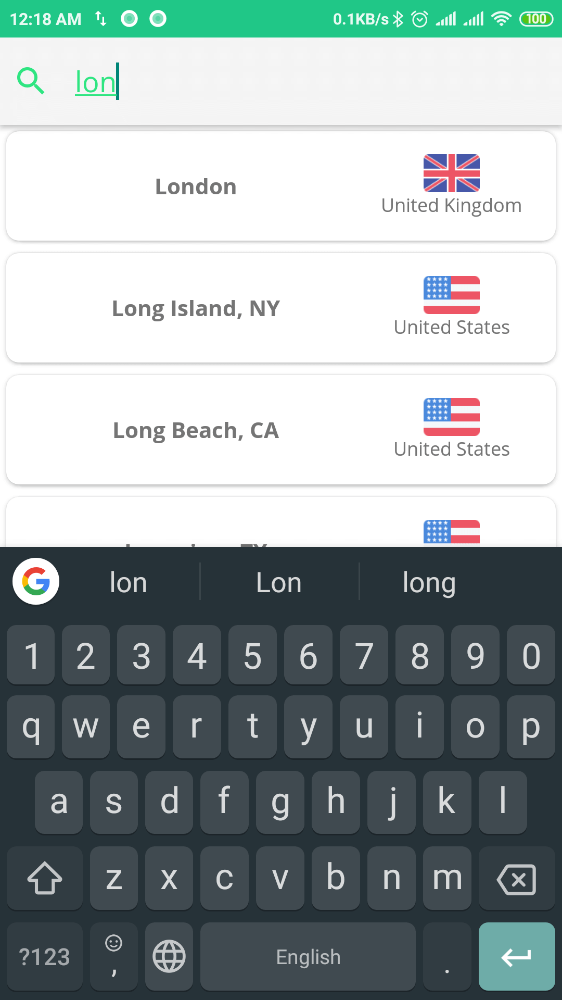

# Restaurant Explorer application

Android application that diplays restaurants in a specific city using *Zomato API*.

  - Support search for a specific city around the world.
  - Displaying restaurants on a google map.
  - Restaurant detail screen: that displays rating, photos, reviews, top cuisines and more info about the restaurant.
  
  ## MVVM-based application
  
  > ***The application built with MVVM architecture pattern. (Using Android Architecture Components).
  Repository Pattern, to abstract the source of data in the application.
  Using of View Model, Live Data and databinding.
  The Application utilizes such popular libraries as: [RxJava](https://github.com/ReactiveX/RxJava), [Dagger2](https://github.com/google/dagger), [OkHttp](https://github.com/square/okhttp), [Retrofit](https://github.com/square/retrofit), [Glide](https://github.com/bumptech/glide), [Google maps](https://developers.google.com/maps/documentation/android-sdk/intro).
 Written in [Kotlin](https://kotlinlang.org/).***
  

  
  ## Screenshots

| Screen description | screenshot\s                    |
| ------------- | ------------------------------ |
| The *initial screen* that shown in *first start* of the app    |   |
| *Search screen* (to search and select city arround the world   |    |
| *The home page* (display restaurants in the city)   |    |
| *The city map* (displays markers in the map that represent a restaurant)   |    |
| Bottom sheet dialog that show info about restaurant after click on a marker |   |
| *Restaurant details screen* |   |
| *Use case* |   |

## Developed By

> Ebraheem Badarni ebraheem.bdarni@gmail.com

